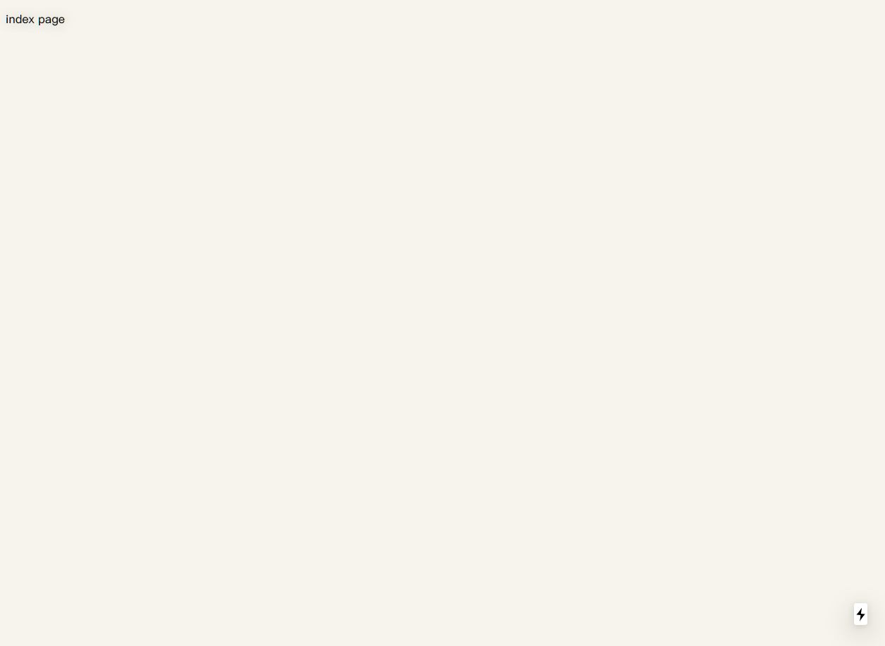

## 简单的next项目搭建步骤


### 1.初始化项目
```bash
mkdir next-demo
cd next-demo
npm init -y
npm install react react-dom next --save
mkdir pages
```

编辑package.json，添加如下内容：
```javascript
{
  "scripts": {
    "dev": "next"
  }
}
```
### 2.启动项目
```bash
npm run dev
```

访问：http://localhost:3000/


这是因为还没有编写页面。

### 3.在pages中编写index.js
```javascript
import React from 'react'

export default class Index extends React.Component {
    constructor(props) {
        super(props)
    }
    render() {
        return (
            <div>
                <p>index page</p>
            </div>
        )
    }
}
```
